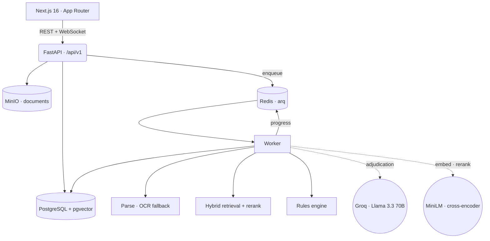

# ClaimSense AI

A claims-integrity workstation for health insurance. It reads a hospital bill,
adjudicates every line against the governing policy, scores the claim for risk,
and lets an analyst agree, disagree or investigate — with every conclusion
traceable to the page it came from.

**Every number the interface shows is computed.** There is no seeded analysis,
no placeholder metric, and no confidence score that isn't measuring something.
Where the system doesn't know, it says so.

---

## The problem

An Indian health-insurance claim arrives as a hospital bill with thirty line
items and a fifty-page policy document. Deciding what is payable means, for each
line, finding the clause that governs it and applying it. That is slow, and it is
where disputes come from: a room-rent cap applied to the wrong tariff, an
excluded consumable paid by mistake, the same MRI billed twice.

ClaimSense does that adjudication line by line and shows its work — which clause,
which page, which words.

---

## What it does

**Reads the documents.** Text-layer extraction with an OCR fallback, so a
scanned or photographed bill still parses. Pages that required OCR are labelled,
because recognised text can be wrong and the reader should know.

**Finds the governing clause.** Hybrid retrieval — dense embeddings for
paraphrase, PostgreSQL full-text for exact references like `clause 4.1` or
`anaesthetist` — fused by reciprocal rank, then reranked by a cross-encoder.

**Adjudicates each line.** Approved, capped, rejected, or needs-review. The model
cites a clause by number from the retrieved set; that number resolves back to a
real passage id, so a fabricated citation resolves to nothing instead of looking
plausible. A line the policy doesn't address becomes `NEEDS_REVIEW` rather than
being approved on an assumption.

**Scores risk, decomposed.** A deterministic rules engine — duplicate lines,
room-rent breaches, service dates outside the stay, excluded items, evidence
gaps. The score is never shown without the contributions that produced it.

**Keeps a human in charge.** Approve, reject, override, escalate, request
evidence, confirm fraud, open an investigation. An override records what it
overrode: the model's verdict is preserved on the decision, not erased by it.

**Remembers.** Every privileged action lands in an append-only audit table. A
claim's full history reconstructs from that table alone, in one query.

---

## Architecture



**Layers.** Routes do HTTP (`api/`), services hold the business logic and import
no web framework (`services/`), models own persistence (`models/`). The worker
imports the same services, so the seed script and the API run identical code.

| | |
|---|---|
| Backend | FastAPI · SQLAlchemy 2 (async) · arq · Alembic |
| Data | PostgreSQL 16 + pgvector · Redis · MinIO |
| AI | Groq `llama-3.3-70b-versatile` · `all-MiniLM-L6-v2` · `ms-marco-MiniLM-L-6-v2` |
| Documents | pdfplumber · Tesseract OCR |
| Frontend | Next.js 16 · TypeScript · Tailwind 4 · Framer Motion · Recharts |
| Scale | 23 tables · 25 endpoints · 5 migrations · 147 tests |

---

## The pipeline

```
upload → parse (OCR fallback) → extract line items → locate each value on the page
       → retrieve clauses (dense + BM25 → fuse → rerank)
       → adjudicate line by line, citing a real passage
       → score risk from deterministic rules
       → human review: agree, override, investigate
```

Stages are **event-driven and idempotent**. Nothing polls: if extraction is still
running when an audit is requested, the audit stands down and the extraction job
enqueues it on completion. Re-running any stage replaces its output rather than
duplicating it — a unique constraint makes two verdicts on one line impossible.

Claim status moves through a declared state machine. A transition outside the
table raises, and every accepted move writes a timeline event.

---

## Evidence and provenance

Extracted values are located in the parsed word geometry and stored with a page
and bounding box. The model is never asked for coordinates, because it would
invent them.

How a value was matched is reported instead of a confidence percentage:

| | |
|---|---|
| `EXACT_PHRASE` | every word matched, in order |
| `NUMERIC_FORM` | an amount matched one of its printed forms (`13500`, `13,500`, `13500.00`) |
| `PARTIAL_TOKEN` | only the most distinctive word matched |

A value that cannot be found gets **no region and no score**, and the interface
says "not located". There is no calibrated probability for an extracted value, so
none is shown.

---

## Security

- Session tokens in an httpOnly, SameSite cookie — unreadable from JavaScript
- bcrypt password hashing; identical error for unknown user and wrong password
- Four roles, enforced server-side in route dependencies, never in the UI alone
- Every query scoped to the caller's organization; another tenant's claim
  returns **404, not 403**, so ids cannot be enumerated
- Rate limiting (tight on login), security headers, upload validation by magic
  bytes rather than filename
- Append-only audit log, enforced by a database trigger

| Role | Can |
|---|---|
| Analyst | upload, run audits, escalate, investigate |
| Senior Analyst | + approve, reject, override, confirm fraud |
| Administrator | manage the platform — deliberately *not* adjudicate |
| Auditor | read only |

Administering the platform and deciding a patient's claim are different jobs;
conflating them is how an audit trail stops meaning anything.

---

## Measured results

Retrieval, over 42 labelled questions against a 24-clause policy, `top_k=5`:

| Configuration | recall@5 | P@1 | MRR | median |
|---|---|---|---|---|
| dense-only (baseline) | 0.952 | 0.786 | 0.861 | 46 ms |
| hybrid | 0.976 | 0.810 | 0.879 | 53 ms |
| **hybrid + rerank** | **1.000** | **0.905** | **0.952** | 552 ms |

Reproduce with `python evaluation/run_retrieval_eval.py`. Method, per-category
breakdown and the limits of these numbers are in
[docs/EVALUATION.md](docs/EVALUATION.md) — including that n=42 on a small,
self-authored corpus is characterisation, not a benchmark.

---

## Running it

**Prerequisites:** Docker Desktop.

```bash
git clone https://github.com/panyakapoor1/ClaimSenseAI.git
cd ClaimSenseAI

cp backend/.env.example backend/.env
# Set GROQ_API_KEY (console.groq.com/keys) and JWT_SECRET.
# Generate a secret: python -c "import secrets; print(secrets.token_urlsafe(48))"

docker compose up -d --build          # first build is slow: torch + models
docker compose run --rm fastapi alembic upgrade head
docker compose run --rm fastapi python scripts/seed.py
```

The seed **runs the real pipeline** — it renders a policy and four bills as
actual PDFs, then parses, adjudicates and scores them. It takes a few minutes and
makes real model calls. Without `GROQ_API_KEY` it still creates and parses the
documents, and leaves the claims visibly un-adjudicated.

| | |
|---|---|
| App | http://localhost:3000 |
| API docs | http://localhost:8000/docs |
| Object storage | http://localhost:9001 (`claimsense` / `claimsense-storage`) |

**Demo accounts** — password `claimsense-demo` for all four:
`analyst@` · `senior@` · `admin@` · `auditor@demo.claimsense.ai`

These are real accounts with hashed passwords behind real authentication. The
credentials are public because it is a demo; do not upload real patient data.

```bash
docker compose run --rm fastapi pytest                        # 147 tests
docker compose run --rm fastapi python evaluation/run_retrieval_eval.py
```

---

## What this does not do

Stated plainly, because a system that hides its limits is harder to trust than
one that names them.

- **The rules-engine weights are chosen, not learned.** A duplicate line is worth
  +26 because that is a stated policy, versioned as `rules-v1` and shown in the
  interface as such. No model was trained on claims data; there is none.
- **`AuditFinding.confidence` is the model's own self-assessment** and is not
  calibrated. Read it as the model's opinion of itself.
- **Retrieval numbers are small-sample.** n=42, 24 clauses, questions and policy
  by the same author.
- **Contradiction detection is not implemented.** The table exists and is empty —
  finding a real contradiction needs cross-document comparison. An empty table is
  better than invented rows.
- **`ai_decisions` is unused.** `audit_findings` already records the AI's per-line
  decision; a second copy would be duplication, not normalisation.
- **No CI, and no frontend tests.** The backend suite is real; the frontend is
  covered only by typecheck and build.
- **OCR is checked for function, not accuracy.** A scanned bill parses; how
  faithfully has not been measured.

---

## Documentation

| | |
|---|---|
| [docs/EVALUATION.md](docs/EVALUATION.md) | Retrieval method, results, and what they don't show |

Architecture, API and design-system documents are not written yet.
