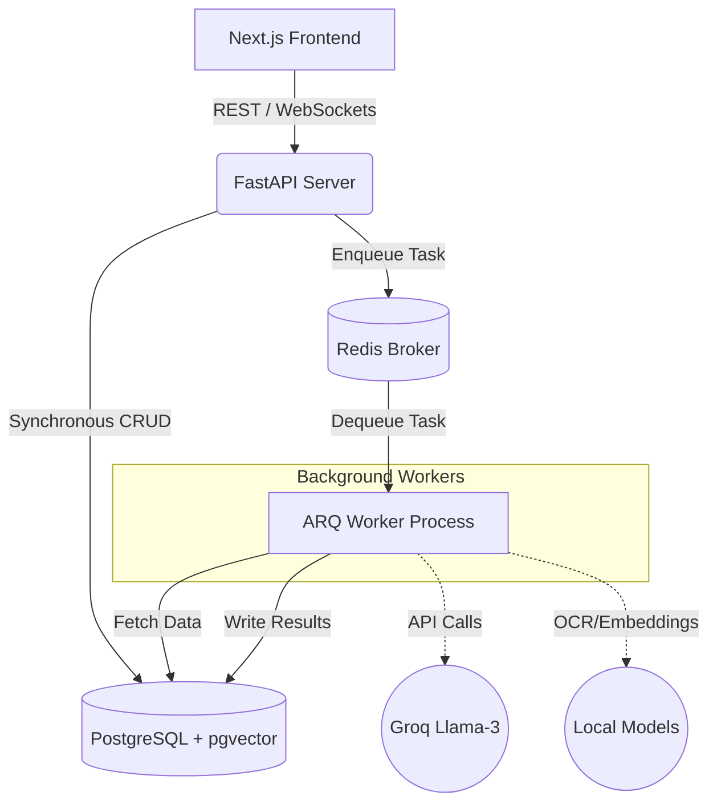
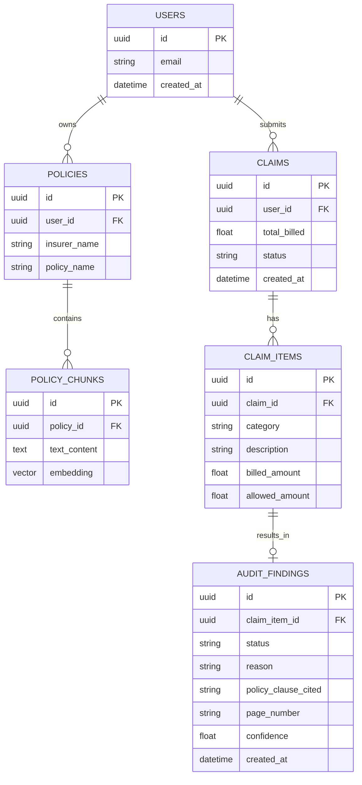

# ClaimSense AI

A Multi-Agent RAG-Based Explainable Insurance Claim Auditor for Indian Healthcare Claims.

## 🚀 Problem Statement

In India, health insurance claims are opaque and difficult to understand. Patients frequently face unexpected partial settlements, room-rent deductions, consumable exclusions, and hidden policy limits. 

Most patients cannot read through a dense 50+ page policy document or verify whether their Third Party Administrator (TPA) has unfairly rejected a claim. **ClaimSense AI** acts as an autonomous, multi-agent advocate that reads hospital bills, correlates them against complex policy documents using RAG, and generates an item-by-item explainable audit report alongside an automated appeal letter.

## ✨ Features

- **OCR Bill Extraction**: Extracts structured line items from raw hospital PDFs.
- **Policy Parsing & RAG**: Chunks and embeds dense insurance PDFs into a vector database for semantic search.
- **Multi-Agent Pipeline**: Specialized AI agents for extraction, auditing, and appeal generation.
- **Explainable Auditing**: Item-by-item breakdown of approved and rejected claims, citing exact policy clauses and page numbers.
- **Automated Appeals**: Generates formal markdown appeal letters tailored to the specific rejection reasoning.
- **Real-Time WebSockets**: Live progress tracking of AI agents streaming directly to the Next.js frontend.
- **Premium Dashboard**: A sleek, dark-mode glassmorphism UI built with Next.js 15 and Tailwind CSS.

## 🏗️ Architecture

The system employs an event-driven, asynchronous microservice architecture to decouple web requests from heavy AI workloads.



## 🛠️ Tech Stack

**Frontend**
* Next.js 15 (App Router)
* TypeScript
* Tailwind CSS v4
* Framer Motion & Lucide Icons

**Backend**
* FastAPI (Python 3.11)
* ARQ (Async Redis Queue)
* SQLAlchemy (Asyncpg)

**Database**
* PostgreSQL with `pgvector`
* Redis (Message Broker & Pub/Sub)

**AI Layer**
* Groq API (Llama-3-70B for fast, free reasoning)
* Local `sentence-transformers` (Embeddings)
* `pdfplumber` (OCR)

## 🤖 Agent Workflow

1. **Bill Extractor Agent**: Uses OCR and LLM reasoning to extract line items from hospital bills and stores them in Postgres.
2. **Policy Ingestion Agent**: Parses dense insurance PDFs, chunks text semantically, generates vector embeddings, and stores them in `pgvector`.
3. **Claim Auditor Agent**: For each claim item, performs semantic search against the policy to retrieve relevant clauses. It then uses an LLM to decide whether the item should be APPROVED or REJECTED, citing the specific policy text and page number.
4. **Appeal Generator Agent**: Gathers all rejected items and their corresponding policy clauses, then drafts a formal appeal letter advocating for the patient.

## 💻 Local Development Setup

ClaimSense AI uses Docker Compose to guarantee environmental consistency.

### Prerequisites
* Docker Desktop installed and running.
* Git.

### 1. Clone the repository
```bash
git clone https://github.com/panyakapoor1/ClaimSenseAI.git
cd ClaimSenseAI
```

### 2. Configure Environment Variables
Copy the example environment file:
```bash
cp backend/.env.example backend/.env
```
*(Add your `GROQ_API_KEY` to the `.env` file).*

### 3. Start the Infrastructure
Build and start the PostgreSQL, Redis, FastAPI backend, ARQ worker, and Next.js frontend containers:
```bash
docker-compose up -d --build
```

### 4. Access the Application
- **Frontend Dashboard:** http://localhost:3000
- **FastAPI Swagger Docs:** http://localhost:8000/docs
- **PgAdmin (if configured):** Available on mapped ports.

## 🗄️ Database Schema



## 🔮 Future Roadmap
- Integration with Indian Health Data Stack (ABDM).
- Support for regional languages (Hindi, Marathi, etc.) using Indic LLMs.
- Direct TPA integration for automated claim submission.

---
*Built with ❤️ for a transparent healthcare system.*
