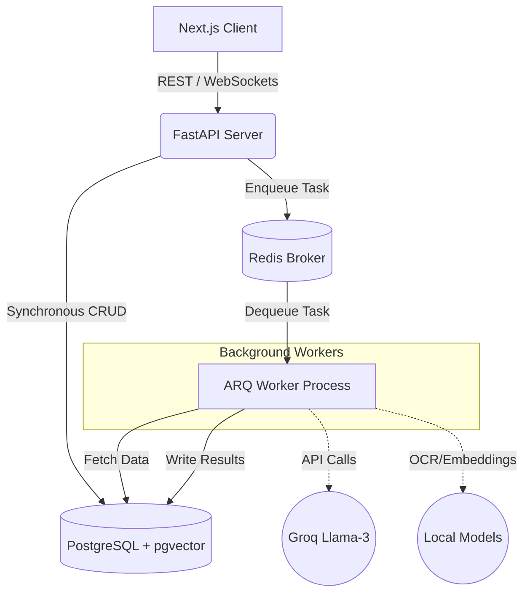
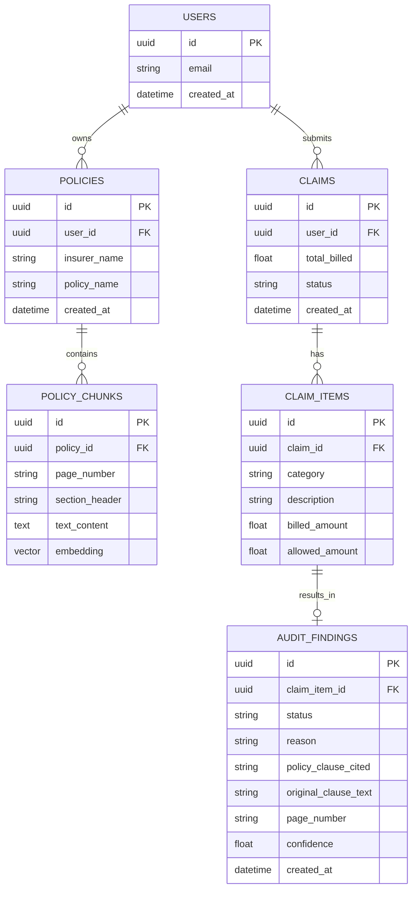

# ClaimSense AI

A Multi-Agent RAG-Based Explainable Insurance Claim Auditor for Indian Healthcare Claims.

## Problem Statement

In India, health insurance claims are opaque and difficult to understand. Patients frequently face unexpected partial settlements, room-rent deductions, consumable exclusions, and hidden policy limits. 

Most patients cannot read through a dense 50+ page policy document or verify whether their Third Party Administrator (TPA) has unfairly rejected a claim. ClaimSense AI acts as an autonomous, multi-agent advocate that reads hospital bills, correlates them against complex policy documents using RAG, and generates an item-by-item explainable audit report alongside an automated appeal letter.

## Features

* OCR Bill Extraction
* Policy Parsing
* RAG Retrieval
* Multi-Agent Pipeline
* Claim Auditing
* Explainable AI
* Appeal Generation
* Real-Time Updates

## Architecture Diagram

The system employs an event-driven, asynchronous microservice architecture to decouple web requests from heavy AI workloads.

## System Design

The system utilizes a containerized, asynchronous microservice architecture. 

1. **Frontend:** A Next.js 15 client dashboard.
2. **API Layer:** FastAPI exposing REST endpoints and WebSockets for real-time progress tracking.
3. **Async Queue:** Redis and ARQ offload heavy AI tasks (OCR, embedding generation, LLM reasoning) from the main API thread.
4. **Data Layer:** PostgreSQL stores structured application data (Users, Claims), while the pgvector extension natively stores and queries policy embeddings in the exact same database, eliminating distributed transaction risks.

## Tech Stack

**Frontend**
* Next.js 15 (App Router)
* TypeScript
* Tailwind CSS
* shadcn/ui

**Backend**
* FastAPI (Python 3.11)
* ARQ (Async Redis Queue)
* SQLAlchemy (Asyncpg)

**Database**
* PostgreSQL
* pgvector
* Redis (Message Broker & Cache)

**AI Layer**
* Groq API (Llama-3-70B for fast, free reasoning)
* local sentence-transformers (Embeddings)
* pdfplumber (OCR)

**Infrastructure**
* Docker & Docker Compose

## Folder Structure

`	ext
ClaimSenseAI/
├── backend/
│   ├── main.py
│   ├── requirements.txt
│   ├── Dockerfile
│   ├── .env.example
│   └── .dockerignore
├── docker-compose.yml
├── .gitignore
└── README.md
`

## Local Development Setup

ClaimSense AI uses Docker Compose to guarantee environmental consistency. 

### Prerequisites
* Docker Desktop installed and running.
* Git.

### 1. Clone the repository
`ash
git clone https://github.com/panyakapoor1/ClaimSenseAI.git
cd ClaimSenseAI
`

### 2. Configure Environment Variables
Copy the example environment file:
`ash
cp backend/.env.example backend/.env
`
*(Add your Groq API key to the .env file).*

### 3. Start the Infrastructure
Build and start the PostgreSQL, Redis, and FastAPI containers:
`ash
docker compose up -d --build
`

The API will be available at http://localhost:8000. You can view the interactive Swagger documentation at http://localhost:8000/docs.

## Environment Variables

| Variable | Description |
|---|---|
| DATABASE_URL | The async connection string to the PostgreSQL database. |
| REDIS_URL | The connection string for the ARQ queue broker. |
| GROQ_API_KEY | API key for Llama-3 inference. |

## Database Schema
The application uses PostgreSQL as its primary datastore, leveraging the `pgvector` extension to fuse relational data with AI embeddings.

## API Documentation
*(Coming Soon)*

## Agent Architecture
*(Coming Soon)*

## RAG Pipeline
*(Coming Soon)*

## Screenshots
*(Coming Soon)*

## Performance Metrics
*(Coming Soon)*

## Future Roadmap
*(Coming Soon)*
